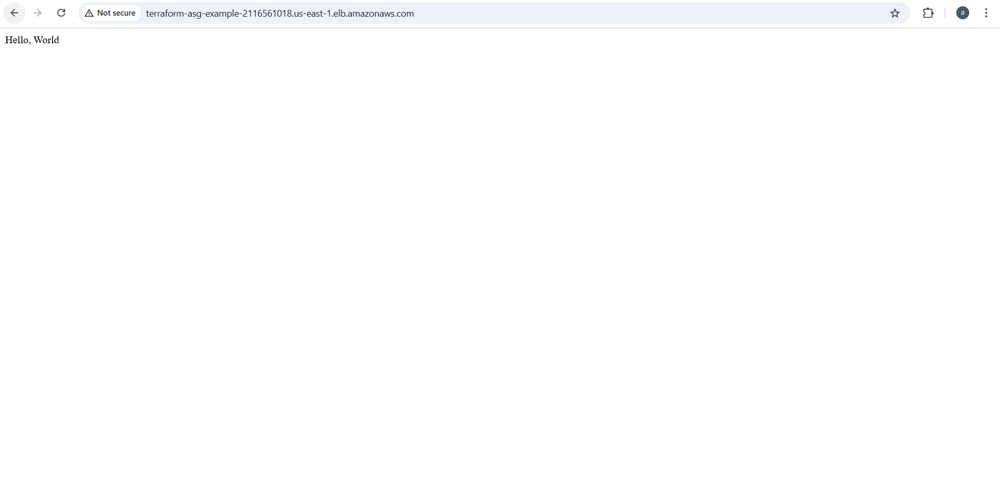
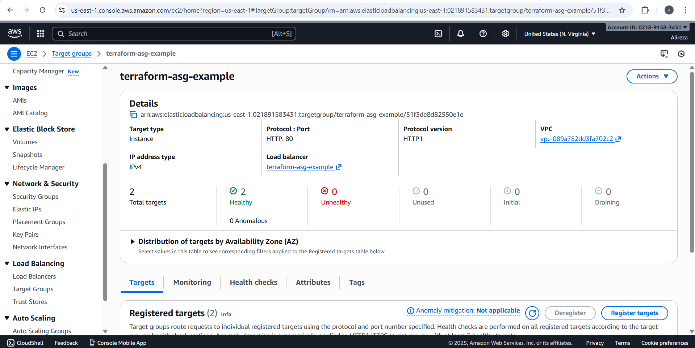
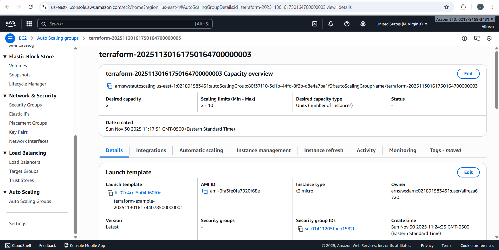

\# Terraform AWS Auto Scaling Group with Load Balancer


This project deploys a highly available web server infrastructure on AWS using Terraform.


\## Architecture

\- Application Load Balancer (ALB)

\- Auto Scaling Group (2-10 instances)

\- EC2 instances running Apache web server

\- Health checks and automatic instance replacement


\## Usage

```bash

terraform init

terraform plan

terraform apply

```


\## Clean up

```bash

terraform destroy

```

## Screenshots

### Working Application


### Healthy Target Group


### Auto Scaling Group


```

---

## **Best Practice Structure:**
```
terraform-asg-alb/
├── main.tf
├── variables.tf
├── outputs.tf
├── .gitignore
├── README.md
└── screenshots/
    ├── hello-world.png
    ├── target-group-healthy.png
    └── asg-instances.png
